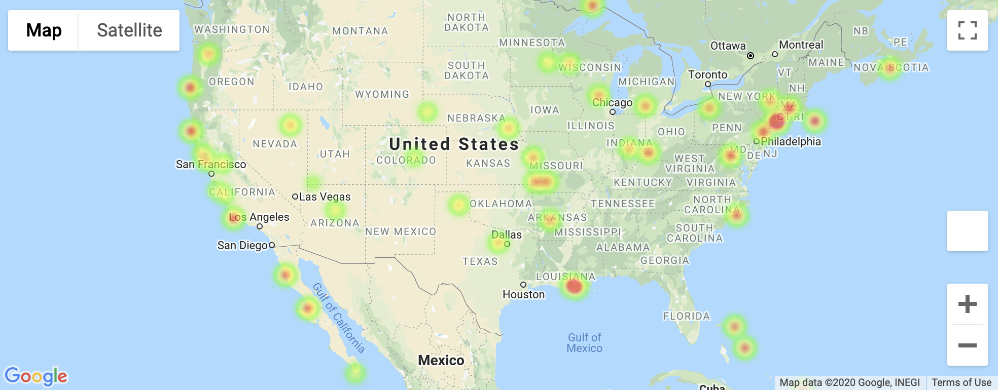
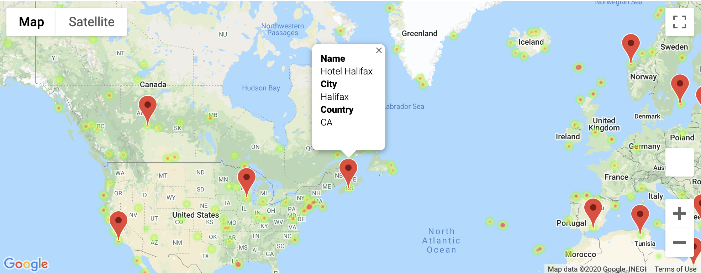

# python-api-challenge

## Background
In this challenge we were asked to use what we've learned about Python requests, APIs, and JSON traversals to answer a fundamental question: "What's the weather like as we approach the equator?"

## Observations
After carefully running the analyiss following observations were made:
1. Max temperature is the variable that shows a prominent observable trend. As the latitude go toward far ends the max temperature tends to start dropping. For most locations near the equatar, in range -20 to 40, the temperature reach max values.
2. Humidity, Cloudiness and Windspeed are quiet variable from location to location and do not show an observable trend with latitude coordinates.
3. The goodness of fit (R-squared) for humidity, cloudiness and windspeed is also very low explaining high variance in data.
4. For humidity it can be observed that southern hemisphere usually has more number of cities with high humidity. This can be a data bias as there more number of cities in northern hemisphere dataframe as compared to southern hemipshere

## Part I - WeatherPy

In this example, you'll be creating a Python script to visualize the weather of 500+ cities across the world of varying distance from the equator. To accomplish this, you'll be utilizing a [simple Python library](https://pypi.python.org/pypi/citipy), the [OpenWeatherMap API](https://openweathermap.org/api), and a little common sense to create a representative model of weather across world cities.

Your first objective is to build a series of scatter plots to showcase the following relationships:

* Temperature (F) vs. Latitude
* Humidity (%) vs. Latitude
* Cloudiness (%) vs. Latitude
* Wind Speed (mph) vs. Latitude

After each plot add a sentence or too explaining what the code is and analyzing.

Your next objective is to run linear regression on each relationship, only this time separating them into Northern Hemisphere (greater than or equal to 0 degrees latitude) and Southern Hemisphere (less than 0 degrees latitude):

* Northern Hemisphere - Temperature (F) vs. Latitude
* Southern Hemisphere - Temperature (F) vs. Latitude
* Northern Hemisphere - Humidity (%) vs. Latitude
* Southern Hemisphere - Humidity (%) vs. Latitude
* Northern Hemisphere - Cloudiness (%) vs. Latitude
* Southern Hemisphere - Cloudiness (%) vs. Latitude
* Northern Hemisphere - Wind Speed (mph) vs. Latitude
* Southern Hemisphere - Wind Speed (mph) vs. Latitude

### Part II - VacationPy

Now let's use your skills in working with weather data to plan future vacations. Use jupyter-gmaps and the Google Places API for this part of the assignment.

* **Note:** if you having trouble displaying the maps try running `jupyter nbextension enable --py gmaps` in your environment and retry.

* Create a heat map that displays the humidity for every city from the part I of the homework.

  

* Narrow down the DataFrame to find your ideal weather condition. For example:

  * A max temperature lower than 80 degrees but higher than 70.

  * Wind speed less than 10 mph.

  * Zero cloudiness.

  * Drop any rows that don't contain all three conditions. You want to be sure the weather is ideal.

  * **Note:** Feel free to adjust to your specifications but be sure to limit the number of rows returned by your API requests to a reasonable number.

* Using Google Places API to find the first hotel for each city located within 5000 meters of your coordinates.

* Plot the hotels on top of the humidity heatmap with each pin containing the **Hotel Name**, **City**, and **Country**.

  
